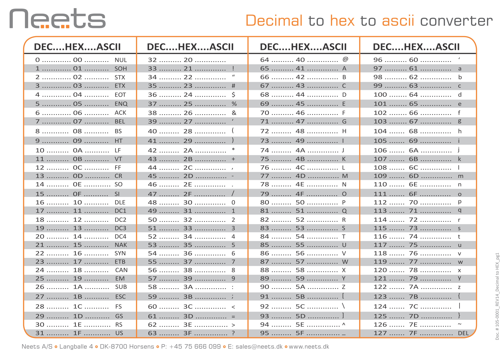

## 凯撒密码简介

凯撒密码是历史上已知最早的密码之一。凯撒密码中的每个字母在字母表中“移动”了一定的位置。例如，如果密码为1，则A将替换为B，B将替换为C，依此类推。相传最早是凯撒大帝用来和将军进行秘密交流时所用的加密方法。

我们更加直观的了解一下凯撒加密，如果密码为3，则A被替换成D、B被替换成E，如下图所示

<p style="text-align:center;"></p>


## 凯撒密码示例

!!! Tip "举例"

	**我们使用密钥1来加密`defend the east wall of the castle`**

首先写出密钥为1时明文和密文的对照表：

<p style="text-align:center;"></p>

对要加密的明文逐个查表替换：D替换为E、E替换为F、F替换为G、E替换为F... 依次类推，直到整段明文都被加密。

```
plaintext:  defend the east wall of the castle
ciphertext: efgfoe uif fbtu xbmm pg uif dbtumf
```

## 凯撒密码的数学描述

首先，我们将所有字符翻译成数字，'a'= 0，'b'= 1，'c'= 2，...，'z'= 25。我们现在可以使用数学描述表示凯撒密码加密函数e(x)，其中x是我们要加密的字符，如：

<p style="text-align:center;"></p>

其中k是密钥（每次加密使用的位移）。使用这个公式加密后的结果为数字，我们需要再将其转换为字母。

解密的数学描述如下：

<p style="text-align:center;"></p>

## 凯撒密码的程序实现

!!! Tip "注意"

	**程序可在python3下运行**

```python
###
###    Date:2018-08-24
###   Time:09:00 GMT
###  Author:nianhua
###

alphabetb = "ABCDEFGHIJKLMNOPQRSTUVWXYZ"
alphabets = "abcdefghijklmnopqrstuvwxyz"

def caser(i,plaintext):
    ciphertext =""
    for j in plaintext:
        if 64 < ord(j) < 91:
            ciphertext += alphabetb[(alphabetb.find(j)+i)%26]
        elif 96 < ord(j) <123:
            ciphertext += alphabets[(alphabets.find(j)+i)%26]
        else:
            ciphertext += j
    return ciphertext

def main():

    plaintext = input("请输入要加密的明文:")
    key = input("请输入密钥:")
    key = int(key)%26
    print(caser(key,plaintext))

if "__main__" == __name__:

    main()
```

运行示例：

<p style="text-align:center;"></p>

## 凯撒密码的密码分析

凯撒密码可能是所有加密方式中最容易破解的密码，由于位移一定是在1~25之间（0或26将导致密文与明文相同），我们可以简单地尝试每种可能，然后看看哪个密钥解密出一段可读文本。如果碰巧知道了一段明文，或者可以猜出一段明文，那么这将使您立即找到密钥。

如果你觉得25种密钥找起来还是太麻烦，那我们还有一种更系统的方法：计算密文中字母的频率分布。因为自然英语每个字母出现的概率具有独特的分布，这可以帮助我们破解密文，如下图所示：

<p style="text-align:center;"></p>

这表明了e是最常见的字母，并且出现的概率约为13％，而z出现的概率远少于1％。凯撒密码的不会改变这些字母的频率，而只是将它们进行了位移（对于密钥为1的凯撒加密意味着最频繁的字母变为f）。密码分析人员只需找出密文频率与自然英语频率匹配的偏移，然后使用该偏移对密文进行解密即可。此方法可轻松的手动破解凯撒密码。

然而现在我们有了计算机之后，就不需要手工破解凯撒密码，而且对于计算机而言25种密钥似乎很渺小，我们缺少的就是一种能够判断哪个密钥解密出来明文是真正有含义的明文，因此我们需要引入一种计算文本是否为英文的算法。

在下面的程序中，我们将使用四字组统计法来确定文本的统计信息，然后计算解密文本为英文的可能性。解密错误的消息（即使用错误的密钥）可能包含序列"QKPC"，这在普通英语中非常罕见。通过这种方式，对不同的密钥进行排序，这样我们就可以找出我们想要的密钥。

**更多的文本表征方式，请查看密码分析小节**

!!! Tip "注意"

	**该程序需要配合密码分析文本表征中的ngram_score评分模块，以及quadgrams字典。请移步至[四元组统计](http://crypto-wiki.io/ClassicalCipher/Cryptanalysis/Quadgram/)。**

```python
###
###    Date:2018-08-24
###   Time:09:00 GMT
###  Author:nianhua
###

from ngram_score import *

fitness = ngram_score('quadgrams.txt')
alphabetb = "ABCDEFGHIJKLMNOPQRSTUVWXYZ"
alphabets = "abcdefghijklmnopqrstuvwxyz"
scoretmp = []
newliste = []
ciphertext = input("请输入要破解的密码:")

def caser(i):
    plaintext =""
    for j in ciphertext:
        if 64 < ord(j) < 91:
            plaintext += alphabetb[alphabetb.find(j)-i-1]
        elif 96 < ord(j) <123:
            plaintext += alphabets[alphabets.find(j)-i-1]
        else:
            plaintext += j
    return plaintext

def main():
    for i in range(26):
        scoretmp.append([])
        plaintext = caser(i) 
        scoretmp[i].append(i)
        scoretmp[i].append(plaintext)
        scoretmp[i].append(fitness.score(''.join(list(filter(str.isalpha,plaintext))).upper()))

    for i in range(26):

        scorevi = -99e9
        goodvi = 0
        for j in scoretmp:
            if j[2] > scorevi:
                scorevi = j[2]
                goodvi = j[0]
        newliste.append(scoretmp[goodvi][:])
        scoretmp[goodvi][2] = -99e9
        print("%2d:%4.2f:%s"%(newliste[i][0],newliste[i][2],newliste[i][1]))


if "__main__" == __name__:

    main()
```

!!! Tip "举例"

	**请使用程序破解这段密文：`Yvccf Nficu`**

查看程序运行结果：

<p style="text-align:center;"></p>

程序通过爆破凯撒密码的密钥，并对解密出来的文本进行评分，按照评分高低进行排序。

## 凯撒密码的扩展

### ROT13

ROT13又称回转13位，是凯撒密码的一种特例。ROT13是它自己本身的逆反；也就是说，要还原ROT13，套用加密同样的算法即可得，故同样的操作可用再加密与解密。

<p style="text-align:center;"></p>

ROT13密码几乎无法提供安全性，很容易被破解。即使攻击者不知道这是ROT13的密文，他仍可以通过假定它是替代密码并使用爬山确定密钥来破解。ROT13密码也是密钥为13 的Caesar密码，因此作为Caesar密码破解也可以。

### ASCII凯撒

顾名思义，ASCII凯撒就是使用ASCII表来对明文进行位移。

如下为ASCII码表：



!!! Tip "举例"

	**请使用密钥206加密：`hello world`**
	
	**答案：`4188; C;>80`**
	
	


