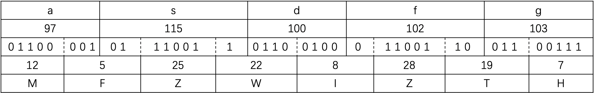

## Base32简介

Base32编码使用32个可打印字符(字母A-Z、数字2-7)对任意字节数据进行编码的方案，编码后的字符串不区分大小写并排除了容易混淆的字符串。

由于数据的二进制传输是按照8比特一组进行的，因此Base32按照5比特切分的二进制数据，所以数据必须是40(5和8的最小公倍数)比特的倍数。

| 数值 | 字符 | 数值 | 字符 | 数值 | 字符 | 数值 | 字符 |
| :-: | :-: | :-: | :-: | :-: | :-: | :-: | :-: |
| 0 | A | 8 | I | 16 | Q | 24 | Y | 
| 1 | B | 9 | J | 17 | R | 25 | Z | 
| 2 | C | 10 | K | 18 | S | 26 | 2 | 
| 3 | D | 11 | L | 19 | T | 27 | 3 | 
| 4 | E | 12 | M | 20 | U | 28 | 4 | 
| 5 | F | 13 | N | 21 | V | 29 | 5 | 
| 6 | G | 14 | O | 22 | W | 30 | 6 | 
| 7 | H | 15 | P | 23 | X | 31 | 7 | 


## 编码



## 解码

方法1. 首先判断长度是否为4的倍数，如果不是，则检查字符串尾部有几个等号，删除等号后将字符串转为二进制、再删除尾部 **等号数量*2个比特** 后解码。

#### 内置库函数解码base32

```python
import base64
string = "Man"
print base64.b32encode(string)
string = "JVQW4==="
print base64.b32decode(string)
```

方法2. 首先将字符串转为二进制，从前至后每8个二进制进行chr()，直到不足8位。

#### 自定义程序解码base32

!!! Tip "提示"

	**使用本程序，我们可以自定义base32编码表、可以忽略base32中的等号而不影响正常解码。**

	**请注意：以后在程序中引用NHbase32，均指的是该文件。**

```python
###
###     FileName:NHbase32.py
###    Date:2018-08-06
###   Time:12:33 GMT
###  Author:nianhua
###

class base32:

    def __init__(self,alphabet = "ABCDEFGHIJKLMNOPQRSTUVWXYZ234567"):
        self.alphabet = alphabet

    def _EnInsideManage(self,strlist):
        strflag = ""
        temp = ord(strlist[0])>>3
        strflag += self.alphabet[temp]
        temp = ((ord(strlist[0])&7)<<2)|(ord(strlist[1])>>6)
        strflag += self.alphabet[temp]
        temp = ((ord(strlist[1])&62)>>1)
        strflag += self.alphabet[temp]
        temp = ((ord(strlist[1])&1)<<4)|(ord(strlist[2])>>4)
        strflag += self.alphabet[temp]
        temp = ((ord(strlist[2])&15)<<1)|(ord(strlist[3])>>7)
        strflag += self.alphabet[temp]
        temp = (ord(strlist[3])&124)>>2
        strflag += self.alphabet[temp]
        temp = ((ord(strlist[3])&3)<<3)|((ord(strlist[4])&224)>>5)
        strflag += self.alphabet[temp]
        temp = ord(strlist[4])&31
        strflag += self.alphabet[temp]
        return strflag    
    
    def enbase32(self,charString):
        encode = ""
        for i in range(len(charString)//5):
            encode +=self. _EnInsideManage(charString[i*5:i*5+5])
        if len(charString)%5!=0:
            if len(charString)%5 == 1:
                encode += self._EnInsideManage(charString[-1:]+chr(0)+chr(0)+chr(0)+chr(0))[:2]+"======"
            if len(charString)%5 == 2:
                encode += self._EnInsideManage(charString[-2:]+chr(0)+chr(0)+chr(0))[:4]+"===="
            if len(charString)%5 == 3:
                encode += self._EnInsideManage(charString[-3:]+chr(0)+chr(0))[:5]+"==="
            if len(charString)%5 == 4:
                encode += self._EnInsideManage(charString[-4:]+chr(0))[:7]+'='
        return encode


    def _TenToBin(self,tenum):

        binstr = ""
        for i in range(4,-1,-1):
            if 1 == (tenum//(2**i)):
                binstr += '1'
                tenum = tenum%(2**i)
            else:
                binstr += '0'
        return binstr

    def _BinToStr(self,strbin):
        "Turn the binary string to a ASCII string"
        strten = ""
        for i in range(len(strbin)//8):
            num = 0
            test = strbin[i*8:i*8+8]
            for j in range(8):
                num += int(test[j])*(2**(7-j))
            strten += chr(num)
        return strten

    def debase32(self,ciphertext):
        binstr = ""
        for i in ciphertext:
            binstr += self._TenToBin(self.alphabet.find(i))
        return(self._BinToStr(binstr))


def main():

    newobj = base32("1234567890abcefghijklmnoprstuvwx")
    print(newobj.enbase32("1233123"))
    print(newobj.debase32(newobj.enbase32("1233123")))


if "__main__" == __name__:
    main()
```

## 扩展

Base32比Base64多占用大约20%的空间，因为Base32使用8个ASCII字符去编码原数据中的5个字节数据，而Base64是使用4个ASCII字符去编码原数据中3个字节。

## 例题

#### 不区分大小写

!!! Tip "例题"

	请解码这串字符串：EbqXgzDgGeZDgnA=

如果直接使用库函数解密，如：

```python
import base64
string = 'EbqXgzDgGeZDgnA='
print base64.b32decode(string)
```

程序直接抛出异常，


**Base32亦可以更换编码表，达到保密的效果，解决方案同Base64**

使用本项目中的[Base32程序](https://github.com/nian-hua/cryptography/tree/master/%E7%BC%96%E7%A0%81%E4%B8%8E%E8%A7%A3%E7%A0%81/Base32)可自定义base32编码表。