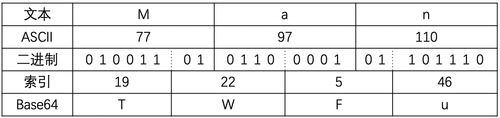
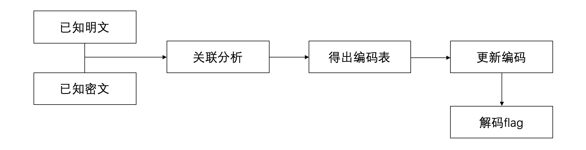

## Base64简介

Base64是网络上最常见的用于传输8Bit字节码的编码方式之一，Base64就是一种基于64个可打印字符来表示二进制数据的方法。

因为2<sup>6</sup> = 64，所以6个比特为一个单元，对应某个可打印字符。3个字符有24比特(3 * 8=24),对应4个Base64单元，**这也就是意味着3个字符将被4个Base64字符表示**

下表为Base64的默认编码表

|KEY|VAL|KEY|VAL|KEY|VAL|KEY|VAL|
|:-:|:-:|:-:|:-:|:-:|:-:|:-:|:-:|
|0|A|16|Q|32|g|48|w|
|1|B|17|R|33|h|49|x|
|2|C|18|S|34|i|50|y|
|3|D|19|T|35|j|51|z|
|4|E|20|U|36|k|52|0|
|5|F|21|V|37|l|53|1|
|6|G|22|W|38|m|54|2|
|7|H|23|X|39|n|55|3|
|8|I|24|Y|40|o|56|4|
|9|J|25|Z|41|p|57|5|
|10|K|26|a|42|q|58|6|
|11|L|27|b|43|r|59|7|
|12|M|28|c|44|s|60|8|
|13|N|29|d|45|t|61|9|
|14|O|30|e|46|u|62|+|
|15|P|31|f|47|v|63|/|

## 编码

首先我们来看一下，如何使用Base64编码一个ASCII字符：

**编码的字节能够被3整除**



**编码的字节数不能被3整除**


## 解码

方法1. 首先判断长度是否为4的倍数，如果不是，则检查字符串尾部有几个等号，删除等号后将字符串转为二进制、再删除尾部 **等号数量*2个比特** 后解码。

#### 内置库函数解码base64

```python
import base64
string = "Man"
print base64.b64encode(string)
string = "TWFu"
print base64.b64decode(string)
```

方法2. 首先将字符串转为二进制，从前至后每8个二进制进行chr()，直到不足8位。

#### 自定义程序解码base64

!!! Tip "提示"

	**使用本程序，我们可以自定义base64编码表、可以忽略base64中的等号而不影响正常解码。**

	**请注意：以后在程序中引用NHbase64，均指的是该文件。**


```python
###
###     FileName:NHbase64.py
###    Date:2018-08-07
###   Time:12:33 GMT
###  Author:nianhua
###

class base64:

    #init function
    def __init__(self,alphabet = "ABCDEFGHIJKLMNOPQRSTUVWXYZabcdefghijklmnopqrstuvwxyz0123456789+/"):
        self.alphabet = alphabet
    
    def _EnInsideManage(self,strlist):
        strflag = ""
        temp = ord(strlist[0]) >> 2
        strflag += self.alphabet[temp]
        temp = ((ord(strlist[0])&3)<<4)|(ord(strlist[1])>>4)
        strflag += self.alphabet[temp]
        temp = ((ord(strlist[1])&15)<<2)|(ord(strlist[2])>>6)
        strflag += self.alphabet[temp]
        temp = (ord(strlist[2])&63)
        strflag += self.alphabet[temp]
        return strflag

    def enbase64(self,charString):
        encode = ""
        for i in range(len(charString)//3):
            encode += self._EnInsideManage(charString[i*3:i*3+3])
        if len(charString)%3!=0:
            if len(charString)%3 == 1:
                encode += self._EnInsideManage(charString[-1:]+chr(0)+chr(0))[:2]+"=="
            if len(charString)%3 == 2:
                encode += self._EnInsideManage(charString[-2:]+chr(0))[:3]+'='
        return encode

    def TenToBin(self,tenum):
        binstr = ""
        for i in range(5,-1,-1):
            if 1 == (tenum//(2**i)):
                binstr += '1'
                tenum = tenum%(2**i)
            else:
                binstr += '0'
        return binstr

    def BinToStr(self,strbin):
        "Turn the binary string to a ASCII string"
        strten = ""
        for i in range(len(strbin)//8):
            num = 0
            test = strbin[i*8:i*8+8]
            for j in range(8):
                num += int(test[j])*(2**(7-j))
            strten += chr(num)
        return strten

    def debase64(self,base64string):
        binstr = ""
        for i in base64string:
            binstr += self.TenToBin(self.alphabet.find(i))
        return self.BinToStr(binstr)

def main():
    newobj = base64("qazwsxedcrfvtgbyhnujmikolpQAZWSXEDCRFVTGBYHNUJMIKOLP-|0987654321")
    print(newobj.debase64(newobj.enbase64("nianhua")))

if "__main__" == __name__:
    main()
```


## 扩展

1. 大多数编码都是字符串转换为二进制的过程，而Base64的编码则是从二进制转换为字符串的过程。
2. Base64编码主要用在传输、存储、表示二进制的过程/领域，不能算加密。
3. 中文有多种编码(例如：utf-8、gb2312、gbk...)，使用不同编码后对应的Base64编码的结果不同

```
字符串  ---------->  0101...1011  ----------> VHW=
        ASCII编码                 Base64编码

字符串  ---------->  0100...0010  ----------> MkL=
         GBK编码                  Base64编码
```

## 例题

#### 等号数量错误导致无法解码

!!! Tip "例题"

	请解码这串字符串：YXNkZg

如果我们直接适用Python程序解码的话，例如：

```python
import base64
string = "YXNkZg"
print base64.b64decode(string)
```

程序会抛出异常，**Incorrect padding**。提示填充不正确，我们可以手动补齐padding，也可以使用本项目中的[Base64程序](#base64_2)

---

#### 使用等号隐匿信息


假设我们想隐匿的数据为'C'，则二进制为01100011，因为一次只能隐匿4个比特，因此需要两串base64.

```
--> 高四位 --> 0110 --> YXNkZm==
--> 低四位 --> 0011 --> YXNkZj==
```
考虑一下编码后如果只有一个等号，那能隐藏多少bit呢？


!!! Tip "例题"

	你能从这些base64中找到什么？
	```
	IiIiCs==
	YXV0aDogYmlnZ2VyLndpbmcKdmVyc2lvbjogdjEuMAr=
	ZnVuY3Rpb246IGN2ZS0yMDE5LTA3MDggUE9DCm==
	dXNhZ2U6Cs==
	bm90ZTogVVNlIHBvYyB0byB0ZXN0LCAzMzg5X2hvc3RzIGlzIGlwIGFkZHJlc3MgbGlzdCwwNzA4ZGV0ZWN0b3IuZXhlIGlzIHBvYwr=
	IiIiCg==
	aW1wb3J0IHJhbmRvbQr=
	aW1wb3J0IHN0cmluZwq=
	cD0iIi5qb2luKFtyYW5kb20uY2hvaWNlKHN0cmluZy5hc2NpaV9sZXR0ZXJzKSBmb3IgaSBpbiByYW5nZSg1KV0pCn==
	cSA9IiIuam9pbihbcmFuZG9tLmNob2ljZShzdHJpbmcuYXNjaWlfbGV0dGVycytzdHJpbmcuaGV4ZGlnaXRzKSBmb3IgaSBpbiByYW5nZSg2KV0pCv==
	cHJpbnQgKHApCm==
	cHJpbnQgKHEpCt==
	ZmxhZz0wCr==
	Y291bnQ9MAo=
	d2hpbGUgVHJ1ZToKICAgIHVzZXJuYW1lPWlucHV0KCJpbnB1dCB5b3VyIG5hbWUiKQo=
	ICAgIGlmIHVzZXJuYW1lID09IHA6Cq==
	ICAgICAgICB3aGlsZSBUcnVlOgp=
	ICAgICAgICAgICAgcGFzc3dkPWlucHV0KCJpbnB1dCB5b3VyIHBhc3N3b3JkIikKICAgICAgICAgICAgaWYgcGFzc3dkID09IHE6Cj==
	ICAgICAgICAgICAgICAgIHByaW50KCJiaW5nbyIpCi==
	ICAgICAgICAgICAgICAgIGJyZWFrCs==
	ICAgICAgICAgICAgZWxzZToKICAgICAgICAgICAgICAgIGZsYWcrPTEKICAgICAgICAgICAgaWYgZmxhZyA9PSAzOgr=
	ICAgICAgICAgICAgICAgIGJyZWFrCj==
	ICAgIGVsc2U6Cp==
	ICAgICAgICBjb3VudCs9MQr=
	ICAgIGlmIGNvdW50ID09IDM6Cg==
	ICAgICAgICBicmVhawq=
	ICAgIHByaW50ICdJIGxpa2UgVGhpcyB3b3JkIScKICAgIHBhc3MgCv==
	ICAgIHByaW50ICdzYXkgaGVsbG8nCiAgIK==
	```

此处我们使用程序来分析隐匿的数据:

```python
import base64
string = '''IiIiCs==YXV0aDogYmlnZ2VyLndpbmcKdmVyc2lvbjogdjEuMAr=ZnVuY3Rpb246IGN2ZS0yMDE5LTA3MDggUE9DCm==dXNhZ2U6Cs==bm90ZTogVVNlIHBvYyB0byB0ZXN0LCAzMzg5X2hvc3RzIGlzIGlwIGFkZHJlc3MgbGlzdCwwNzA4ZGV0ZWN0b3IuZXhlIGlzIHBvYwr=IiIiCg==aW1wb3J0IHJhbmRvbQr=aW1wb3J0IHN0cmluZwq=cD0iIi5qb2luKFtyYW5kb20uY2hvaWNlKHN0cmluZy5hc2NpaV9sZXR0ZXJzKSBmb3IgaSBpbiByYW5nZSg1KV0pCn==cSA9IiIuam9pbihbcmFuZG9tLmNob2ljZShzdHJpbmcuYXNjaWlfbGV0dGVycytzdHJpbmcuaGV4ZGlnaXRzKSBmb3IgaSBpbiByYW5nZSg2KV0pCv==cHJpbnQgKHApCm==cHJpbnQgKHEpCt==ZmxhZz0wCr==Y291bnQ9MAo=d2hpbGUgVHJ1ZToKICAgIHVzZXJuYW1lPWlucHV0KCJpbnB1dCB5b3VyIG5hbWUiKQo=ICAgIGlmIHVzZXJuYW1lID09IHA6Cq==ICAgICAgICB3aGlsZSBUcnVlOgp=ICAgICAgICAgICAgcGFzc3dkPWlucHV0KCJpbnB1dCB5b3VyIHBhc3N3b3JkIikKICAgICAgICAgICAgaWYgcGFzc3dkID09IHE6Cj==ICAgICAgICAgICAgICAgIHByaW50KCJiaW5nbyIpCi==ICAgICAgICAgICAgICAgIGJyZWFrCs==ICAgICAgICAgICAgZWxzZToKICAgICAgICAgICAgICAgIGZsYWcrPTEKICAgICAgICAgICAgaWYgZmxhZyA9PSAzOgr=ICAgICAgICAgICAgICAgIGJyZWFrCj==ICAgIGVsc2U6Cp==ICAgICAgICBjb3VudCs9MQr=ICAgIGlmIGNvdW50ID09IDM6Cg==ICAgICAgICBicmVhawq=ICAgIHByaW50ICdJIGxpa2UgVGhpcyB3b3JkIScKICAgIHBhc3MgCv==ICAgIHByaW50ICdzYXkgaGVsbG8nCiAgIK=='''
alphabet = "ABCDEFGHIJKLMNOPQRSTUVWXYZabcdefghijklmnopqrstuvwxyz0123456789+/"
newstring = ""
for i in range(len(string)-1,-1,-1):
    try:
        if string[i] == '=' and string[i+1] != '=':
            newstring += '\n'
        newstring += string[i]
    except:
        newstring += string[i]
newstring = newstring[::-1]
newstring = newstring.split('\n')
flag = ''
binstr = ''
for i in newstring:
    number = 0
    if i[-1:] == '=':
        i = i[:-1]
        number += 1
    if i[-1:] == '=':
        i = i[:-1]
        number +=1    
    if number == 1:
        pass
        binstr+= '{:06b}'.format(alphabet.find(i[-1:]))[4:]
    if number == 2:
        binstr+= '{:06b}'.format(alphabet.find(i[-1:]))[2:]
print binstr
for i in range(len(binstr)//7):
	flag += chr(int(binstr[7*i:7*i+7],2))
print flag
```

---

#### 对编码表进行变换

对于更换了编码表的题目，一般可以使用已知明文攻击，尽量还原出编码表。

使用本项目中的[Base64程序](#base64_2)可自定义base64编码表。



!!! Tip "例题"

	请解密这段密文:FqsCFkiVDSWMWByZGSWZKqPUAPbRGdzb

	提示：

	这是泄漏的一段明文:

	```!QAZ@WSX#EDC$RFV%TGB^YHN&UJM*IK<(OL>)P:?_{"+}|`1qaz2wsx3edc4rfv5tgb6yhn7ujm8ik,9ol.0p;/-['=]\The problem is that programs_width is a list. programs_width = list(). If none of these if statements if prog_width == '342' When you read an English book, you often come across new words. You might try to guess what the words mean from the words you know, but when you cannot guess the meanings of new words at all, what should you do?```
	
	和对应的密文:

	```8P51AN1SOhXByOy39596PVPOyg9LAOCE9MP+IUr9UfaeIgan+P0xRhbc8VibZ60sJA5xQwKfL3WMF6QgJqFjWSywDBFzG6lkKAriE6My/3MpH2laJ3up/PuwRPhJP6CM871dHj9uFAgXGSQXK6CCK21aJqbwJq5iJhbkGAygG21rJd1C86srJkTo871dHjKdDAhfSkKrF7ye83gXH6MfK2Xr/V19FV1oHjzM86bq87yeFSWM86Mq87WgDSyMHAPoK7QXGADXJ79pFhbkGAygG20bRU0wQfTd9d1SG6Po87MpKU1dFA5N865o84PoFjsrJjXXDqbpGdaXLAbh86bqK6Po86WpHAOXDAWdHkWf86zMKd1kHk9NJdlXAAbh86hrFjCg87ydLU1gHd1wKAPfJd1kG65g87yeFU1kHk9NJd1iFA5o86FdHjgXK6CM87KpJqyf87MpKU1yHqbk/21VKSTXKjCMHV1zHkOXDj5oHqbg86KhFSWf87yeFU1iFA5oGAzwJd1pFV1oFSJXKjbdF7QXDSTXDAsu/21kG65g87WeHkPuF21zHkOXF6vm```

这里我们使用程序来处理这道题目：

```python
from NHbase64 import *

nvarry = ['0' for i in range(64)]
binstr = ''
string = '''!QAZ@WSX#EDC$RFV%TGB^YHN&UJM*IK<(OL>)P:?_{"+}|`1qaz2wsx3edc4rfv5tgb6yhn7ujm8ik,9ol.0p;/-['=]\The problem is that programs_width is a list. programs_width = list(). If none of these if statements if prog_width == '342' When you read an English book, you often come across new words. You might try to guess what the words mean from the words you know, but when you cannot guess the meanings of new words at all, what should you do?'''
basest = "8P51AN1SOhXByOy39596PVPOyg9LAOCE9MP+IUr9UfaeIgan+P0xRhbc8VibZ60sJA5xQwKfL3WMF6QgJqFjWSywDBFzG6lkKAriE6My/3MpH2laJ3up/PuwRPhJP6CM871dHj9uFAgXGSQXK6CCK21aJqbwJq5iJhbkGAygG21rJd1C86srJkTo871dHjKdDAhfSkKrF7ye83gXH6MfK2Xr/V19FV1oHjzM86bq87yeFSWM86Mq87WgDSyMHAPoK7QXGADXJ79pFhbkGAygG20bRU0wQfTd9d1SG6Po87MpKU1dFA5N865o84PoFjsrJjXXDqbpGdaXLAbh86bqK6Po86WpHAOXDAWdHkWf86zMKd1kHk9NJdlXAAbh86hrFjCg87ydLU1gHd1wKAPfJd1kG65g87yeFU1kHk9NJd1iFA5o86FdHjgXK6CM87KpJqyf87MpKU1yHqbk/21VKSTXKjCMHV1zHkOXDj5oHqbg86KhFSWf87yeFU1iFA5oGAzwJd1pFV1oFSJXKjbdF7QXDSTXDAsu/21kG65g87WeHkPuF21zHkOXF6vm"
for i in string:
	binstr += '{:08b}'.format(ord(i))
for i in range(len(binstr)//6):
	nvarry[int(binstr[6*i:6*i+6],2)] = basest[i]
password = ''
for i in nvarry:
	password += i
newobj = base64(alphabet=password)
print(newobj.debase64("FqsCFkiVDSWMWByZGSWZKqPUAPbRGdzb"))
```
首先我们通过明文和密文的对应，一一 **计算出Base64的编码规则** ，随后使用 **NHbase64** 模块，手动指定编码表，对密文进行解密。

!!! Tip "提示"

	**另一种思路：**

	**在得出编码表之后，我们是不是可以通过新旧编码表来将密文转换为正常的Base64编码数据呢？**

---
